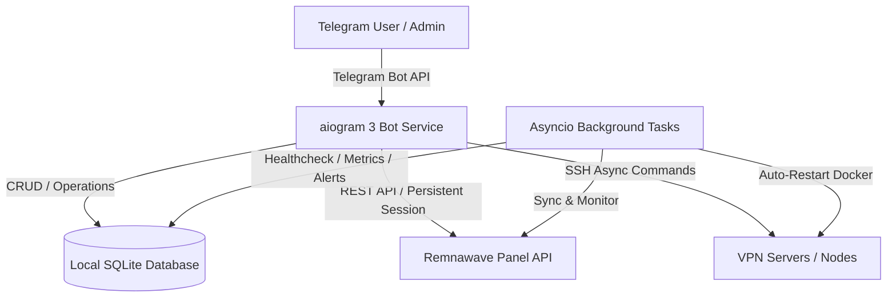
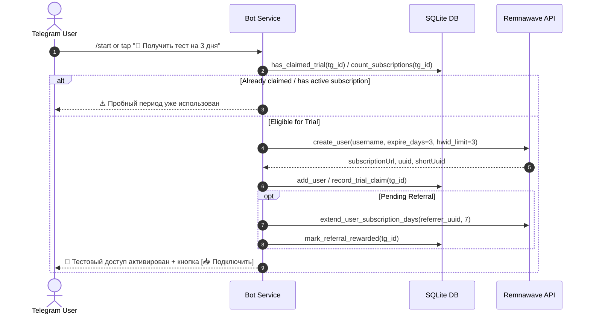

# Architecture Overview

`bot_remna` is an advanced Telegram bot built with **aiogram 3** for managing Remnawave VPN panel subscriptions, nodes, tokens, promocodes, users, notifications, and analytics.

## System Boundaries & Services

## Core Modules

- **`bot.py` & `app.py`**: Telegram bot entry point, routing, core navigation, subscription linking, deep-links, and lifecycle state management.
- **`remnawave_api.py`**: Async client wrapper for Remnawave API (with connection pooling via `aiohttp.ClientSession`, automatic resolution between UUID/shortUuid/numeric IDs, and retry handling).
- **`database.py`**: SQLite database models and queries (`aiosqlite`) for users, roles, subscriptions, referral relations, node metrics, notification logs, and audit trails.
- **`handlers/`**:
  - `admin_analytics.py`: Real-time analytics, user bandwidth aggregation, node comparison charts, and summary reports.
  - `admin_nodes.py`: Node management, online status polling, ping, enable/disable toggle, and SSH remote execution.
  - `admin_dm.py` & `admin_notifications.py`: Direct messaging, broadcast announcements, and notification preferences.
  - `connect.py`: Interactive connection wizard, QR code generators, deep-linking, and client setup instructions.
- **`scheduler.py`**: Background cron jobs for expiration alerts, node status checks, high CPU alerts, node auto-restart, and metric collection.
- **`services/`**:
  - `chart_generator.py`: Matplotlib-based chart generation for traffic series and node comparison.

## User Onboarding & Trial Flow

