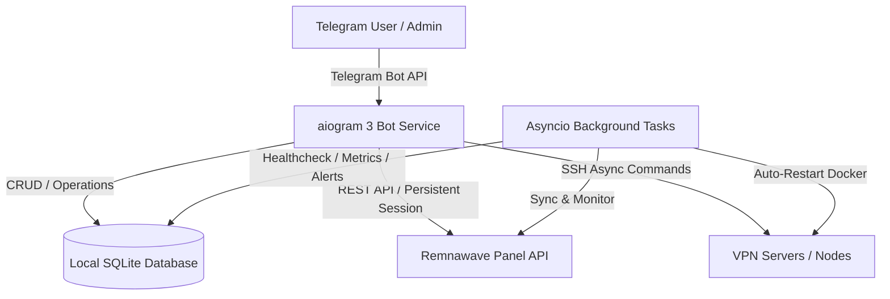
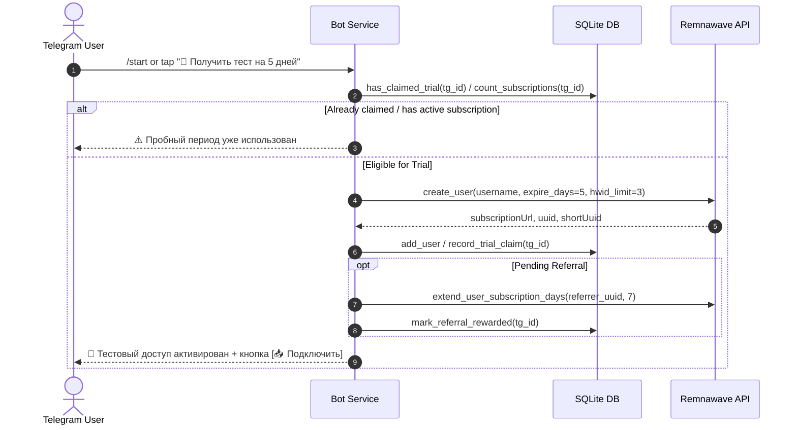

# Architecture Overview

`bot_remna` is an advanced Telegram bot built with **aiogram 3** for managing Remnawave VPN panel subscriptions, nodes, tokens, promocodes, users, notifications, and analytics.

## System Boundaries & Services

```mermaid
flowchart TD
    TG[Telegram User / Admin] -->|Telegram Bot API| Bot[aiogram 3 Bot Service]
    Bot -->|CRUD / Operations| SQLite[(Local SQLite Database)]
    Bot -->|REST API / Persistent Session| Remna[Remnawave Panel API]
    Bot -->|SSH Async Commands| Nodes[VPN Servers / Nodes]
    Scheduler[Asyncio Background Tasks] -->|Healthcheck / Metrics / Alerts| SQLite
    Scheduler -->|Sync & Monitor| Remna
    Scheduler -->|Auto-Restart Docker| Nodes
```

## Core Modules

- **`bot.py` & `app.py`**: Telegram bot entry point, routing, core navigation, subscription linking, deep-links, and lifecycle state management.
- **`remnawave_api.py`**: Async client wrapper for Remnawave API (with connection pooling via `aiohttp.ClientSession`, automatic resolution between UUID/shortUuid/numeric IDs, and retry handling).
- **`database.py`**: SQLite database models and queries (`aiosqlite`) for users, roles, subscriptions, referral relations, node metrics, notification logs, and audit trails.
- **`handlers/`**:
  - `admin_analytics.py`: Real-time analytics, user bandwidth aggregation, node comparison charts, daily traffic report aggregation (`collect_daily_traffic_data`, `format_daily_report_text`), `/daily_report` command, and summary reports.
  - `admin_nodes.py`: Node management, online status polling, ping, enable/disable toggle, and SSH remote execution.
  - `admin_dm.py` & `admin_notifications.py`: Direct messaging, broadcast announcements, and notification preferences.
  - `connect.py`: Interactive connection wizard, QR code generators, deep-linking, and client setup instructions.
- **`scheduler.py`**: Background cron and interval jobs:
  - Expiration alerts for clients and admins (`check_expiring_subscriptions`).
  - Node healthcheck every 2 minutes (`check_nodes_health`).
  - Node CPU load check every 1 minute (`check_cpu_load`).
  - Daily traffic report at 23:59 MSK (`send_daily_traffic_report`).
  - Daily bot SQLite database and configuration backup at 01:00 MSK (`run_daily_backup`).
  - Automated Remnawave panel backup (Postgres database dumpall + configs) runs host-level via `rw-backup-restore` cron (`@daily` / midnight) uploading `remnawave_backup_panel_*.tar.gz` to the admin Telegram chat.
- **`services/`**:
  - `chart_generator.py`: Matplotlib-based chart generation:
    - Node load history charts (CPU, RAM, users online).
    - 30-day cluster total traffic sparkline charts.
    - Node traffic comparative charts.
    - Daily 23:59 node traffic distribution donut charts (`generate_daily_nodes_distribution_chart`) with dark cyberpunk styling, KPI callout, and sanitized emoji glyphs.

## User Onboarding & Trial Flow

```mermaid
sequenceDiagram
    autonumber
    actor User as Telegram User
    participant Bot as Bot Service
    participant DB as SQLite DB
    participant API as Remnawave API

    User->>Bot: /start or tap "🎁 Получить тест на 5 дней"
    Bot->>DB: has_claimed_trial(tg_id) / count_subscriptions(tg_id)
    alt Already claimed / has active subscription
        Bot-->>User: ⚠️ Пробный период уже использован
    else Eligible for Trial
        Bot->>API: create_user(username, expire_days=5, hwid_limit=3)
        API-->>Bot: subscriptionUrl, uuid, shortUuid
        Bot->>DB: add_user / record_trial_claim(tg_id)
        opt Pending Referral
            Bot->>API: extend_user_subscription_days(referrer_uuid, 7)
            Bot->>DB: mark_referral_rewarded(tg_id)
        end
        Bot-->>User: 🎉 Тестовый доступ активирован + кнопка [📥 Подключить]
    end
```
